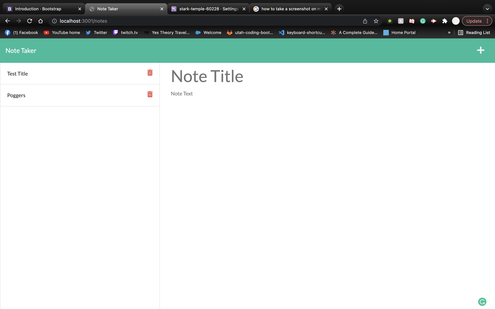

# Note Taker
  ## Project Description
  This project was built using Express and creating a server which allows you to take notes

  ## Table of Contents
  1. [Description](#project-description)
  2. [Licenses](#license)
  3. [Installation](#installation)
  4. [Screenshots](#Photos)
  5. [Github](#Github)

  ## License
  
  Licensed under MIT

  ## Installation
  * Make Sure you have VsCode installed or any IDE
  * Once you have your IDE installed clone the project to your local machine 
  * Open your terminal and navigate to the repository and install required packages using NPM (follow this link for more info on installing NPM https://docs.npmjs.com/downloading-and-installing-node-js-and-npm)
  * Once required packages have been installed run npm start and start taking notes!!!
  
  ## Photos
  